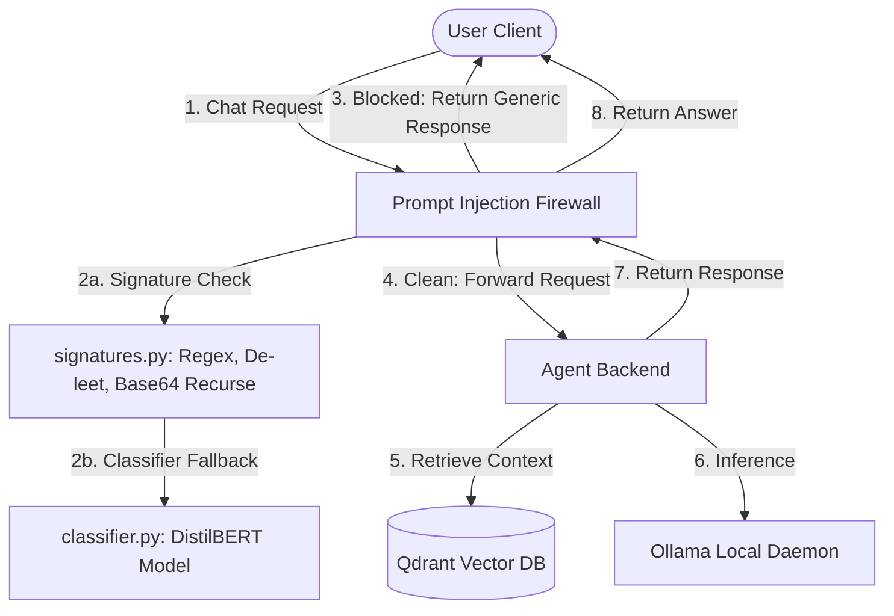

# Prompt Injection Firewall & Secure Proxy Agent

A robust, multi-layered security firewall and proxy agent designed to intercept and screen user messages for prompt injections (PI) before forwarding clean inputs to an LLM-powered backend.



---

## Firewall Security Architecture

The firewall proxy intercepts the `/chat` route of the backend and runs the input message through sequential filters.

### 1. Layer 1: Signature-Based Detection ([firewall/signatures.py])
This layer runs deterministic checks on the incoming text:
* **Leet Translation (`deleet`)**: Decodes 1337-speak modifications (e.g., `1gn0r3` -> `ignore`).
* **Normalization (`normalize`)**: Collapses homoglyphs (NFKC normalization), strips zero-width/invisible characters, and collapses separators to flatten obfuscated strings.
* **Injection Pattern Scanner**: Matches against a set of regex rules detecting instructions overrides, rules bypasses, and jailbreak commands.
* **Persona Hijack / Roleplay Scanner**: Specifically flags attempts to force the LLM into unrestricted personas or fictional scenarios (e.g., act as an uncensored assistant).
* **Delimiter / System-Tag Scanner**: Detects faked system markers (e.g., `<|im_start|>`, `[INST]`, `<<SYS>>`, `### Instruction`) to prevent attackers from mimicking system instructions.
* **Recursive Base64 Decoder**: Automatically identifies Base64 blocks, decodes them, and recursively runs the signature checks on the decoded content.

### 2. Layer 2: Classifier-Based Detection ([firewall/classifier.py])
If the signature engine clears the request, it falls back to a **DistilBERT classifier model**.
* *Note: Currently structured as a placeholder stub, ready for embedding loading and inference.*

---

## Security Defense & Logging Pattern

To keep the firewall resilient against adversarial exploration, we enforce a strict information security posture:

### Generic Client Refusal
* When a prompt is blocked by **any** layer (signatures, classifier, or LLM judge), the client receives the exact same uninformative response:
  ```json
  {
    "response": "I can't help with that request.",
    "model": "firewall"
  }
  ```
* **Why**: Specific error reasons (e.g., "Matched 'jailbreak' signature") leak info, allowing attackers to incrementally iterate around our filters. Flattened responses prevent model fingerprinting.

### Server-Side Security Logs
Full request telemetry is logged warning-level to the server console/logs for auditability:
```python
logger.warning({
    "event": "prompt_injection_detected",
    "layer": "signature",          # or "classifier", "llm_judge"
    "matched_pattern": signature,  # regex string or model confidence score
    "user_id": user_id,            # user identifier if passed
    "message": "original_message", 
    "timestamp": "UTC timestamp",
    "action": "blocked"
})
```

---

## Project Structure

```text
├── backend/                  # LLM agent logic, vector database retrieval, and API
│   ├── agent/                # Agent core modules
│   └── server.py             # Backend endpoints (FastAPI)
├── firewall/                 # Security firewall proxy
│   ├── main.py               # Firewall router & proxy endpoints (FastAPI)
│   ├── signatures.py         # Signature definitions, regex patterns, and text cleaning
│   └── classifier.py         # Classifier ML model wrapper (DistilBERT stub)
├── frontend/                 # Chat web interface
├── test.py                   # Root test harness for verifying pattern detectors
└── docker-compose.yml        # Orchestration containing Ollama, Qdrant, Backend, Firewall, Frontend
```

---

## Running and Testing

### Running the Test Suite
Verify your signature and base64 parsing patterns against malicious test vectors:
```powershell
python test.py
```

### Launching the Stack
Build and launch the full stack (Ollama, Qdrant, Backend, Firewall, and Frontend) via Docker Compose:
```bash
docker-compose up --build
```
Once initialized, client requests directed to port `80` (Frontend) are routed securely through the Firewall (port `5000`) before reaching the Backend agent (port `8000`).
